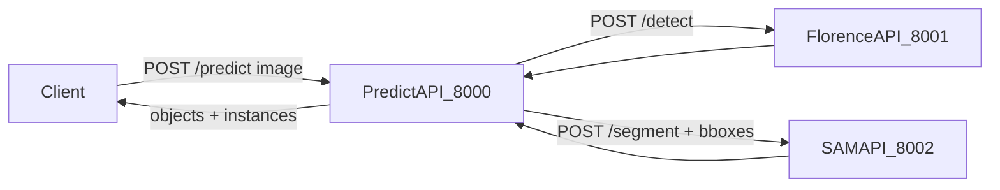

# coins-obj-seg

Монорепозиторий из трех FastAPI-сервисов для пайплайна object detection + segmentation:

- `florence_api` находит объекты и возвращает bbox.
- `sam_api` строит маски по bbox.
- `predict_api` оркестрирует оба сервиса и возвращает итоговый JSON для клиента.

## Архитектура



## Быстрый старт (Docker Compose)

Требования:

- Docker + Docker Compose plugin.
- Достаточно места на диске для моделей.

Запуск:

```bash
docker compose up --build
```

Сервисы и порты:

- `predict-api` -> `http://localhost:8000`
- `florence-api` -> `http://localhost:8001`
- `sam-api` -> `http://localhost:8002`

Проверка health:

```bash
curl http://localhost:8000/health
curl http://localhost:8001/health
curl http://localhost:8002/health
```

## Сервисы

- [`services/florence_api/README.md`](services/florence_api/README.md) - детекция объектов (bbox).
- [`services/sam_api/README.md`](services/sam_api/README.md) - сегментация по bbox и ZIP с масками.
- [`services/predict_api/README.md`](services/predict_api/README.md) - оркестрация и агрегированный ответ.

## Переменные окружения

У каждого сервиса есть свой `.env` (и шаблон `.env.example`):

- `services/florence_api/.env`
- `services/sam_api/.env`
- `services/predict_api/.env`

При запуске через `docker-compose.yml` подключаются именно `.env` файлы сервисов.
