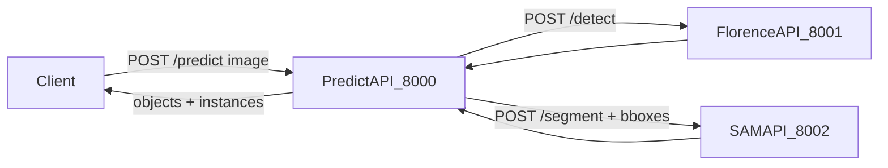

# coins-obj-seg

Монорепозиторий из трех FastAPI-сервисов для пайплайна object detection + segmentation:

- `florence_api` находит объекты и возвращает bbox.
- `sam_api` строит маски по bbox.
- `predict_api` оркестрирует оба сервиса и возвращает итоговый JSON для клиента.

## Архитектура



## W/out docker

### Requirements

- `Python 3.12`
- `astral uv` (опционально, но оч удобно)
- Установить зависимости (лежат внутри каждого сервиса)

### predict_api

```bash
cd services/predict_api/
uv run uvicorn main:app --host 0.0.0.0 --port 8000
```

### florence_api

```bash
cd services/florence_api/
uv run uvicorn main:app --host 0.0.0.0 --port 8001
```

### sam_api

```bash
cd services/sam_api/
uv run uvicorn main:app --host 0.0.0.0 --port 8002
```

## Docker

```bash
docker compose build
docker compose up
# или конкретные сервисы
docker compose up predict-api florence-api sam-api
```

## Проверка

Сервисы и порты:

- `predict-api` -> `http://localhost:8000`
- `florence-api` -> `http://localhost:8001`
- `sam-api` -> `http://localhost:8002`

Проверка health:

```bash
curl http://localhost:8000/health
curl http://localhost:8001/health
curl http://localhost:8002/health
```
